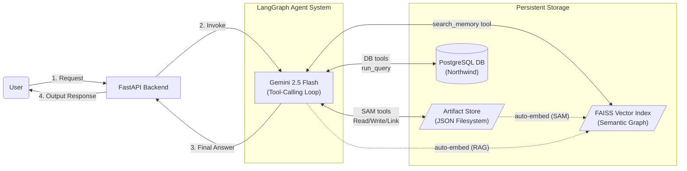
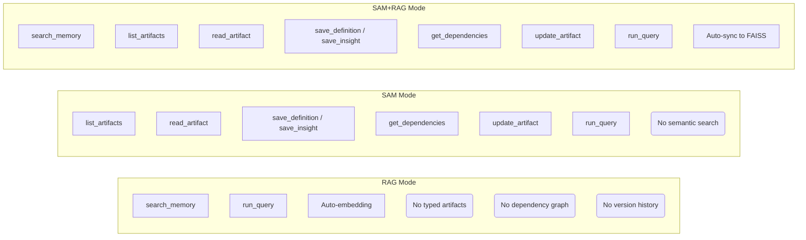
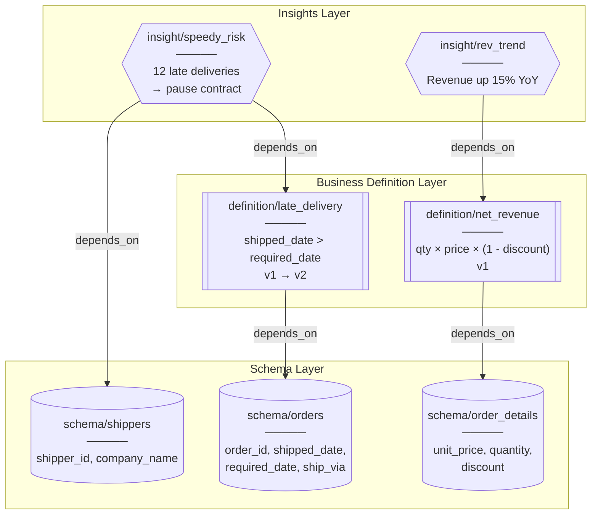
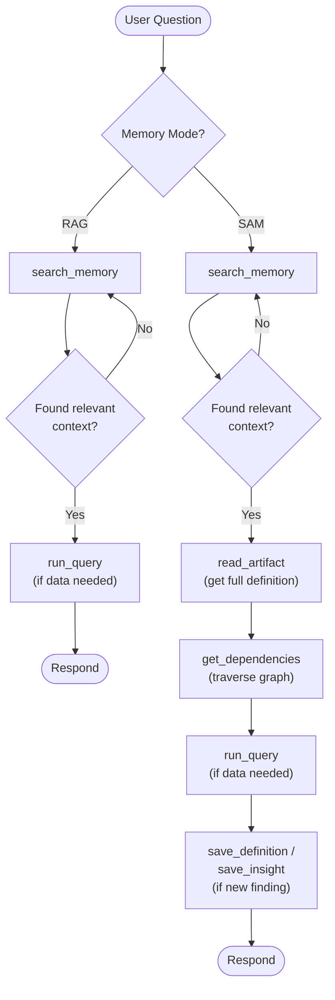
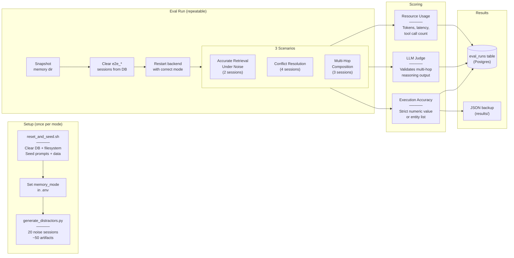
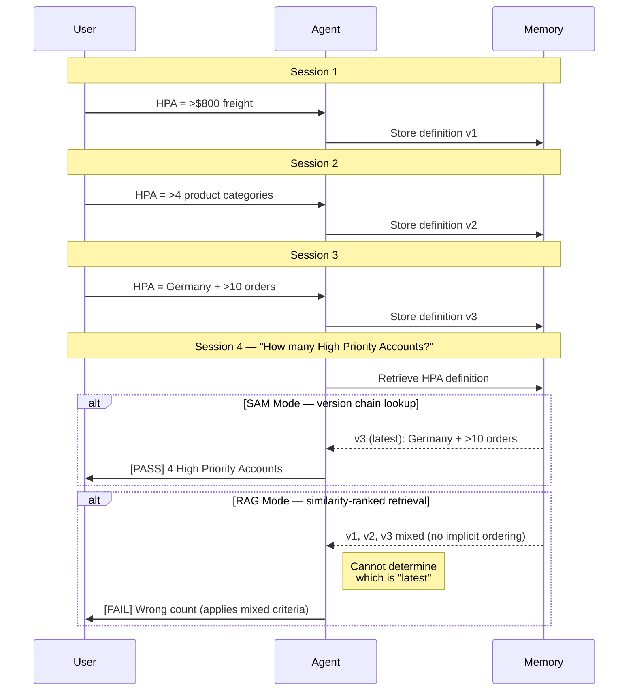
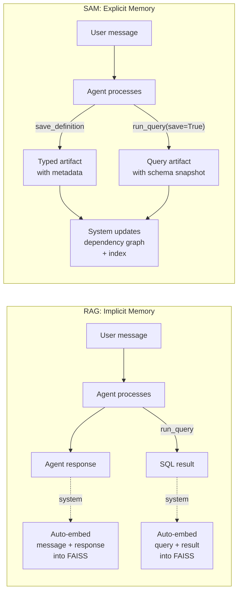
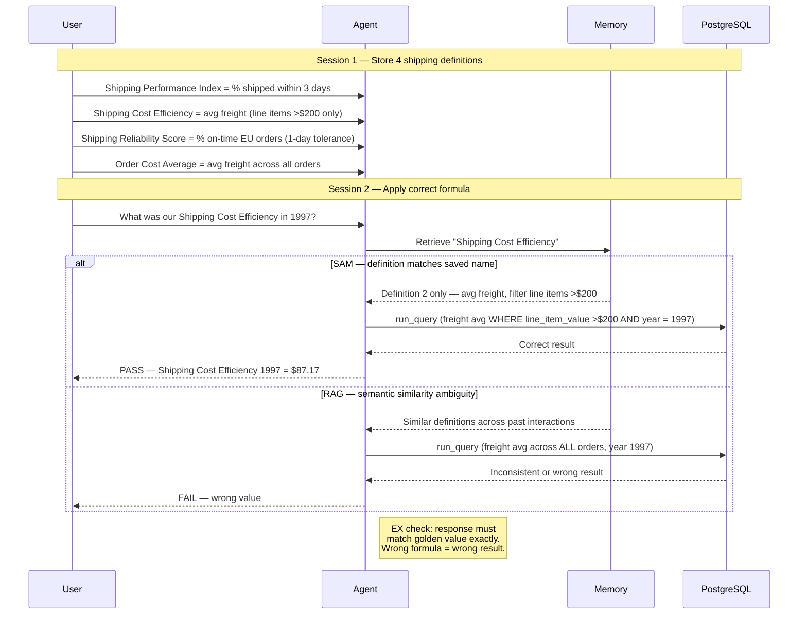

# Thesis Diagrams

Mermaid diagrams for inclusion in the thesis. Each diagram targets a specific chapter / section.
All diagrams use shape, text, and line-style to convey meaning — no color-dependent information.

---

## 1. Overall System Architecture (Ch. 4)

High-level view of all system components and how they connect.



---

## 2. Memory Mode Ablation (Ch. 4, §4.3 / Ch. 7, §7.2)

Shows which capabilities each mode provides — directly supports the ablation argument.
Uses `[Available]` and `(Missing)` node shapes to distinguish present vs absent capabilities.



---

## 3. SAM Artifact Graph Structure (Ch. 5)

Illustrates how artifacts relate to each other via typed dependency edges.
Each layer uses a distinct node shape: `[(database)]` for schema, `[[box]]` for definitions, `[/parallelogram/]` for queries, `{{hexagon}}` for insights.



---

## 4. Agent Workflow per Mode (Ch. 4, §4.2)

Decision flow showing how the agent processes a user question under each mode.
Each mode's branch is labelled; terminal nodes use `([stadium])` shape.



---

## 5. Evaluation Pipeline (Ch. 7, §7.1)

End-to-end flow of how evaluation runs are executed and scored.



---

## 6. Conflict Resolution Failure (Ch. 7 / Ch. 8)

Illustrates exactly why RAG fails and SAM succeeds on the conflict resolution scenario.
Uses `alt` blocks labelled with mode names; outcomes marked with `[PASS]` and `[FAIL]`.



---

## 7. Auto-Embedding Data Flow (Ch. 6, §6.1)

Shows how RAG memory is populated automatically vs SAM's explicit management.
RAG flow uses dashed lines for implicit system actions; SAM uses solid lines for agent-driven actions.



---

## 8. Scenario 1 — Accurate Retrieval Under Noise (Ch. 7, Appendix B)

Agent defines 3 similar shipping performance definitions in S1, then must apply the correct one in S2 under noise. Each definition has company-specific thresholds that cannot be guessed from the name.



---

## 9. Scenario 2 — Conflict Resolution (Ch. 7, Appendix B)

High Priority Account is redefined 3 times with entirely different criteria; agent must use the latest version.

```mermaid
sequenceDiagram
    participant U as User
    participant A as Agent
    participant M as Memory
    participant DB as PostgreSQL

    Note over U,DB: Session 1
    U->>A: HPA = >$800 freight
    A->>M: Store v1 (supersedes none)

    Note over U,DB: Session 2
    U->>A: HPA = Germany + >10 orders
    A->>M: Store v2 (supersedes v1)

    Note over U,DB: Session 3
    U->>A: HPA = >4 categories
    A->>M: Store v3 (supersedes v2)

    Note over U,DB: Session 4 — must use v3
    U->>A: How many High Priority Accounts?
    A->>M: Retrieve HPA definition

    alt SAM — version chain
        M-->>A: v3 only (latest by chain)
        A->>DB: run_query (count accounts matching v3 criteria)
        DB-->>A: 50 accounts
        A-->>U: PASS — 50 HPAs (>4 categories)
    else RAG — similarity search
        M-->>A: v1 + v2 + v3 mixed (no ordering)
        A->>DB: run_query (ambiguous — which criteria to use?)
        DB-->>A: Inconsistent or wrong count
        A-->>U: FAIL — wrong count (cannot determine latest)
    end

    Note right of A: EX check: strict match<br/>response must = 50 accounts

---

## 10. Scenario 3 — Multi-Hop Composition (Ch. 7, Appendix B)

Agent must chain: business definition → dependent business rule → SQL to identify flagged suppliers.

```mermaid
sequenceDiagram
    participant U as User
    participant A as Agent
    participant M as Memory
    participant DB as PostgreSQL

    Note over U,DB: Session 1 — Define base concept
    U->>A: Underperforming Product = ordered <30 times total
    A->>M: Store definition
    A-->>U: Acknowledged

    Note over U,DB: Session 2 — Define dependent rule
    U->>A: Supplier Review rule: >2 Underperforming Products → flag supplier
    A->>M: Store rule (references Underperforming Product)
    A-->>U: Acknowledged

    Note over U,DB: Session 3 — Evaluate multi-hop
    U->>A: Which suppliers should be flagged for Supplier Review?
    A->>M: Retrieve rule

    alt SAM — follows reference chain
        M-->>A: Supplier Review rule + Underperforming Product definition (via link)
        A->>DB: run_query (join both definitions into one query)
        DB-->>A: 2 suppliers matched (New Orleans, Grandma Kelly's)
        A-->>U: PASS — 2 suppliers flagged
    else RAG — follows reference chain
        M-->>A: Supplier Review rule
        A->>M: Follow breadcrumbs to retrieve all definitions
        A->>DB: run_query
        DB-->>A: Results depend on whether agent reasons correctly
        A-->>U: FAIL — depends on underlying LLM's reasoning <br>capability to retrieve correct definitions
    end

    Note right of A: EX via LLM judge: response<br/>must name both suppliers
```
